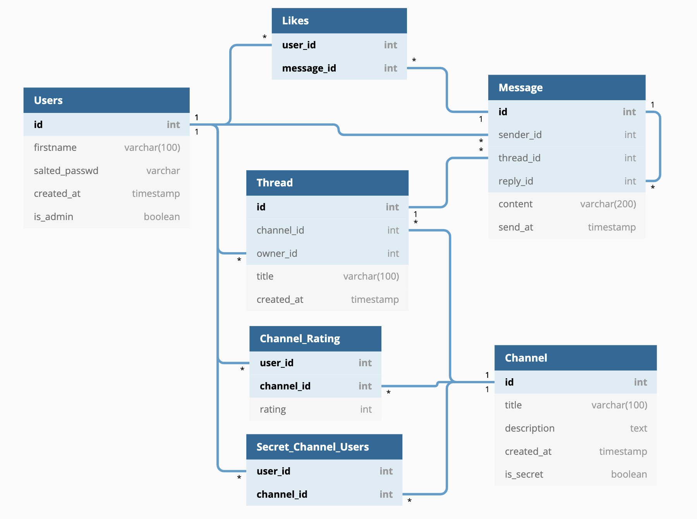

# Sovelluksen määrittelydokumentti

## Johdanto

## Sisällysluettelo
 * [Käyttötapaukset](#käyttötapaukset)
   + [Vierailija](#vierailija)
   + [Käyttäjä](#kirjautunut-käyttäjä)
   + [Järjestelmänvalvoja](#järjestelmänvalvoja)
 * [Tietomalli](#tietomalli)
    + [Luokka kaavio](#luokkakaavio)
    + [Tietokantakaavio](#tietokantakaavio)

## Alustaminen
- [x] Tietokanta alustetaan annetuilla alkuperäis arvoilla.

## Käyttötapaukset

### Vierailija
Tämä rooli kuvaa sivustossa käyvää vierailijaa, joka ei ole vielä kirjautunut sisään.

- [x] Vierailijat voivat rekisteröityä, kirjautua sisään ja ulos.
- [x] Vierailija voi nähdä kanavaluettelon sovelluksen etusivulla.
- [x] Vierailija näkee sovelluksen etusivulla listan alueista sekä
      jokaisen alueen ketjujen ja viestien määrän ja viimeksi lähetetyn viestin ajankohdan.

- [x] Vierailija voi katsella kanavia ja niiden alueita (viestiketjuja).
- [x] Vierailija voi katsella ja hakea viestejä.
- [x] Vierailija voi katsella, kuinka monta tykkäystä viesti on saanut.

### Kirjautunut käyttäjä
Tämä rooli kuvaa sivustoon sisäänkirjautunutta käyttäjää.

#### Kanavat
- [x] Sisäänkirjautunut käyttäjä voi katsella ja arvioida kanavan.

#### Keskustelualueet
- [x] Sisäänkirjautunut käyttäjä voi luoda uuden viestiketjun (keskustelualue) linkitetyllä kanavalla.
- [x] Luotuihin viestiketjuihin on linkitetty ensimmäinen viesti.
- [x] Käyttäjä voi muokata luomansa viestiketjun otsikkoa.
- [x] Käyttäjä voi poistaa luomansa viestiketjun.

#### Viestit
- [x] Sisäänkirjautunut käyttäjä voi lähettää viestin mille tahansa olemassa olevalle julkiselle säikeelle.
- [x] Käyttäjä voi muokata lähettämänsä viestin sisältöä.
- [x] Käyttäjä voi poistaa minkä tahansa lähettämänsä viestin.
- [x] Käyttäjä voi tykkäyksen kaikista viesteistä.
- [x] Käyttäjä voi poistaa tykkäyksen viestistä.

### Ylläpitäjä
Tämä rooli kuvaa sivustoon ylläpitäjää (järjestelmänvalvojaa).

- [x] Sovelluksella on oletusarvoisesti ylläpitäjä.
- [x] Ylläpitäjä voi lisätä, muokata ja poistaa kanavia (keskustelupalstat).
- [x] Ylläpitäjä voi lisätä, muokata ja poistaa salaisia ​​kanavia.
- [x] Ylläpitäjä voi määrittää, millä käyttäjillä on pääsy millekin salaiselle kanavalle.

## Tietomalli

### Luokkakaavio

### Tietokantakaavio
Tämä kaavio luotiin [tästä tiedostosta](./database-diagram.txt) käyttäen [dbdiagram.io](dbdiagram.io) palvelua ja
se löytyy [verkosta](https://dbdiagram.io/d/60b2812bb29a09603d171c27).
