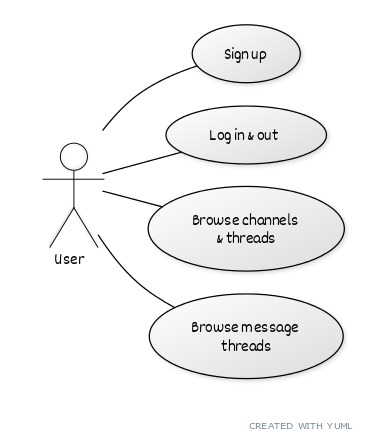
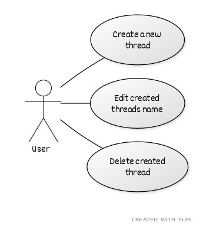
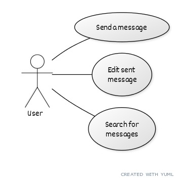
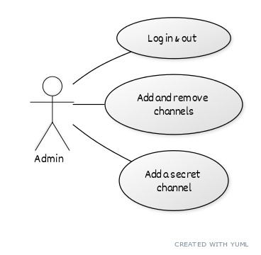
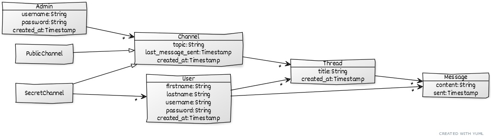

# Documentation

## Table of contents
 * [Use cases](#use-cases)
   + [User](#user)
     - [Browse channels](#login-and-browse-channels)
     - [Manage threads](#manage-threads)
     - [Messaging](#messaging)
   + [Admin](#admin)
 * [Data model](#data-model)
    + [Class diagram](#class-diagram)
    + [Database schema](#database-schema)

## Setup
- [x] The database is initialized with initial values.

## Use cases

### User

#### Login and browse channels
- [x] Users can register, log in, and log out.
- [x] The user sees a list of channels on the front page of the application.
- [x] The list of channels contains the number of threads and messages in each channel and the time of the last message sent.

#### Manage threads
- [x] The user can create a new thread to a given channel.
- [x] The created thread has a first message linked to it.
- [x] The user can edit the title of the thread he has created.
- [x] The user can delete the thread he has created.

#### Messaging
- [x] The user can search for messages.
- [x] The user can send a message to an existing thread.
- [x] The user can edit the content of the message he has sent.
- [x] The user can delete the message he has sent.

### Admin
- [x] The application has a default administrator.
- [x] The administrator can add channels (discussion boards).
- [x] The administrator can delete channels.
- [x] The administrator can create a secret channel.
- [x] The administrator can determine which users have access to that secret channel.

## Data model

### Class diagram

### Database schema
This diagram was generated from [this file](./database-diagram.txt) using [dbdiagram.io](dbdiagram.io) and
can be found [online](https://dbdiagram.io/d/60b2812bb29a09603d171c27).

