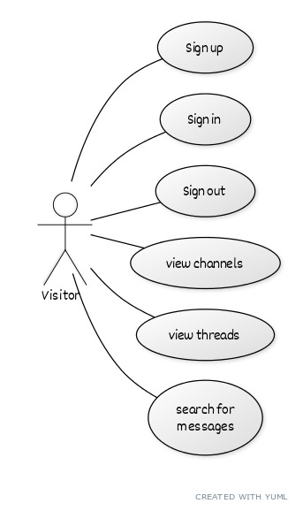
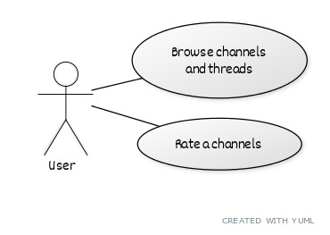
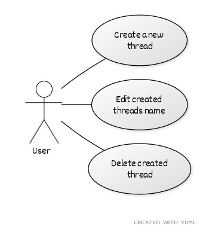
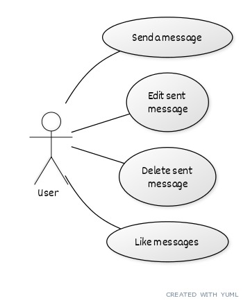
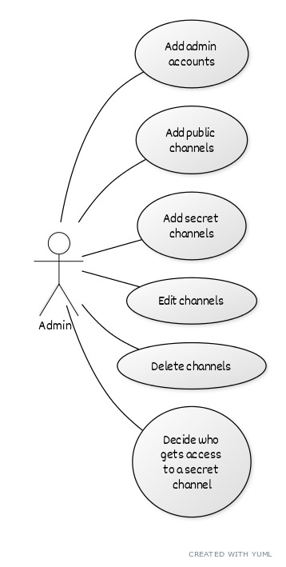
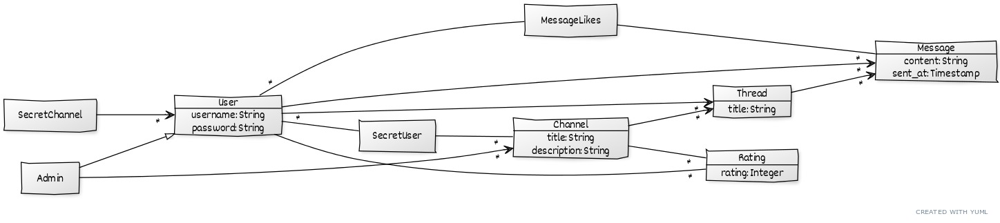

# Documentation

## Introduction
This is a chat app where there are chat rooms called channels
and message threads. Users can view and rate channels, and
send/like messages. For more detail see the description below.

## Table of contents
 * [Use cases](#use-cases)
   + [User](#user)
     - [Browse channels](#login-and-browse-channels)
     - [Manage threads](#manage-threads)
     - [Messaging](#messaging)
   + [Admin](#admin)
 * [Data model](#data-model)
    + [Class diagram](#class-diagram)
    + [Database schema](#database-schema)

## Setup
- [x] The database is initialized with initial values.

## Use cases

### A visitor to the site
- [x] Visitors can register, log in, and log out.
- [x] A visitor can see a list of channels on the front page of the application.
- [x] The list of channels contains the number of threads and messages in each channel,
      the time of the last message sent, and the average rating channel has given.

- [x] A visitor can browse channels and their threads.
- [x] A visitor can see and search messages.
- [x] A visitor can see the number of likes a message has recieved.

### Logged in user

#### Channels
- [x] A logged in user can rate a channel.

#### Threads
- [x] A logged in user can create a new thread linked to a channel.
- [x] The created thread has first message linked to it.
- [x] The logged in user can edit the title of the thread he has created.
- [x] The logged in user can delete the thread he has created.

#### Messaging
- [x] A logged in user can send a message to any existing public thread.
- [x] The logged in user can edit the content of the message he has sent.
- [x] The logged in user can delete any message he has sent.
- [x] The logged in user can like any message.
- [x] The logged in user can remove like from any previously liked message.

### Admin
- [x] The application has a default administrator.
- [x] The administrator can add, edit, and delete channels (discussion boards).
- [x] The administrator can add, edit, and delete secret channels.
- [x] The administrator can determine which users have access to that secret channel.

## Data model

### Class diagram

### Database schema
This diagram was generated from [this file](./database-diagram.txt) using [dbdiagram.io](dbdiagram.io) and
can be found [online](https://dbdiagram.io/d/60b2812bb29a09603d171c27).

